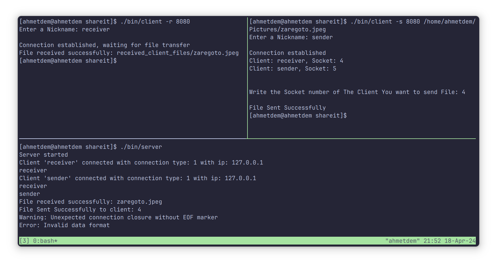

# Shareit

## Overview
- This one is a project ~~(experiment)~~ that i wanted to make for a long time, understanding and implementing how the file sharing apps work over the local net, socket programming and implementing a client-server like design.

- Of course there are so much errors, bad design choices and probably the most insecure and not very efficient program there is but i think that is enough for a demo.

- I might visit this project later but I've got what I've wanted for now.

- Uses my own [parser](https://github.com/ahmetdem/parser). (need to improve that project)

# Usage
To compile the project, clone the repository and navigate to it and use the provided Makefile:

```bash
make
```

This will compile the project, then you can use the executable files in the `bin` directory.

- Keep in mind that you need to change the IP address within the `clientMain.cpp` to the Ip address of the computer you want to send files.

	```cpp
	Client client("127.0.1.1", name); // change the IP address
	```	


1. Use the `./bin/server` code to start a server from the computer you will send files. 

2. Use this to tell the server that you are ready to receive files: 
	```bash
	./bin/client -r <port_number> // usually 8080
	```

3. Then you can send files over via this command:

	```bash
	./bin/client -s <port_number> <file_path>
	```

	Also Choose the socket number of the client you want to send files. ~~(Yes you can send files to yourself over the net)~~



- **Note to Self:** Solve this error, i do not know why but after the complation of the file transfer the program sends another 0 bytes of data.


